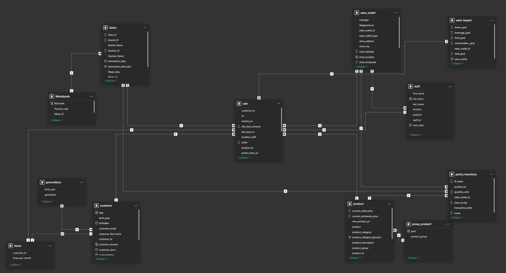

# Data Analyst Project: Evaluation of the Coffee Shop's Q4 Business Performance and Strategic Analysis for the Upcoming Coffee Market

This project is a dashboard primarily programmed in Python and visualized with Power BI. The project consists of two parts: file ppbix for the dashboard and Vietnames document for analyzing the dataset.

## Introduction

The "Coffee sales and marketing" dataset was referenced by our team from the Kaggle platform, which provides a diverse and multidimensional database to support application analysis in the Business Intelligence course. The selection of this topic and dataset is driven by the fact that the coffee industry is gradually becoming one of the fastest-growing business trends in the current market. Collecting and analyzing data in this field helps coffee businesses better understand customer behavior, shape marketing strategies, manage inventory, and optimize business operations. [📌 Coffee Shop Sample Data on Kaggle](https://www.kaggle.com/datasets/ylchang/coffee-shop-sample-data-1113/code)


The overview of this dataset provides detailed insights into various aspects of coffee business operations, ranging from sales performance and inventory levels to customer purchasing behavior. Our initial objective is to assist coffee shop chains in making data-driven decisions, optimizing business efficiency, and developing effective marketing strategies to compete in the market.

The "Coffee sales and marketing" dataset contains representative information on the retail activities of a coffee shop chain in the United States. This dataset was created by Amber and Sandeep with the purpose of being used for data-driven analysis and decision-making.

The overview of this dataset provides detailed information on all aspects of coffee business operations, from sales and inventory to customer purchasing behavior. The initial goal of the team is to help coffee shop chains make data-driven decisions, optimize business performance, and develop effective marketing strategies to compete in the market.  

The **"Coffee sales and marketing"** dataset contains representative information about the retail operations of a coffee shop chain in the United States. This dataset was created by Amber and Sandeep for the purpose of data-driven analysis and decision-making.  

**Sales Receipts:** This table contains information about each sales transaction, including items sold, quantity, prices, and transaction timestamps. Through this table, you can analyze sales trends over time, identify popular products, and assess revenue generation.  

**Pastry Inventory:** This table provides information about the quantity and stock status of various bakery products in stores. You can use this information to manage inventory, predict ingredient demand, and optimize the production process.  

**Sales Targets:** This table contains sales targets set until April 19 for each store or the entire chain. This helps evaluate business performance against the targets and adjust marketing strategies accordingly.  

**Customer:** This table contains customer information, including personal details, purchase history, and buying behavior. You can use this data to gain a deeper understanding of the customer base, create targeted marketing strategies, and enhance customer engagement.  

**Dates:** This reference table provides date-related information used in other dataset tables. It helps connect time-based data across different tables and facilitates time-series analysis.  

**Product:** This table contains detailed information about the products being sold, including names, descriptions, and prices. It assists in product catalog management and marketing strategy development.  

**Sales Outlet:** This table provides information about sales locations within the chain, including addresses and location details. You can use this information to analyze store distribution and optimize new store openings.  

**Staff:** This table contains employee information, including names, job positions, and work performance. Through this table, you can manage human resources and enhance team efficiency.  

**Generation:** This table contains information about customer generations, which may include indicators or characteristics of different customer groups. This helps in market segmentation and in developing more effective marketing strategies based on the specific traits of each customer group.  

Utilizing and analyzing this dataset allows coffee businesses to gain deeper market insights, respond quickly to customer demands, and optimize business performance.

## Project Objective

The aim of this project is to analyze the factors that determined the company's success during the 2016-2019 period, forecast trends in the bicycle and sports accessory market, and propose strategies that will help the company maintain and expand its market presence while optimizing operational efficiency.


## quick start
You can open a demo for a deployment link in this bike-retail-dashboard.vercel.appbike-retail-dashboard.vercel.app after powerBI authentication
In the other hand, you can start following these step
### Clone repo into your space
```
git clone https://github.com/dinhtanloc/coffee_sale_dashboard.git
code coffee_sale_dashboard
# use Live server to open html file and start with prj
```


